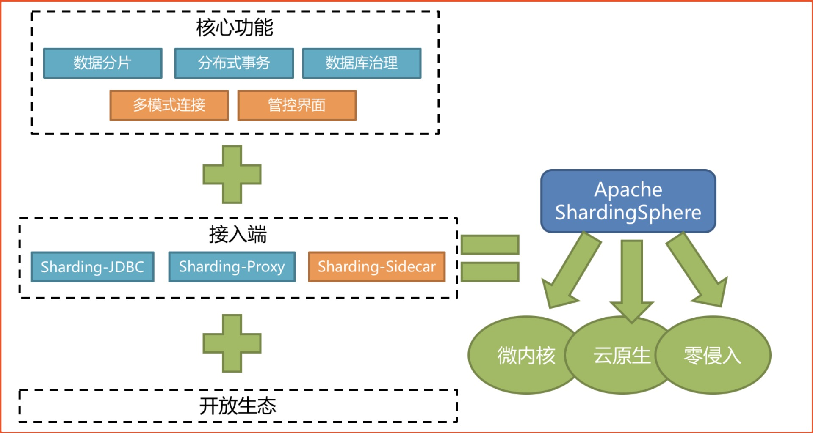
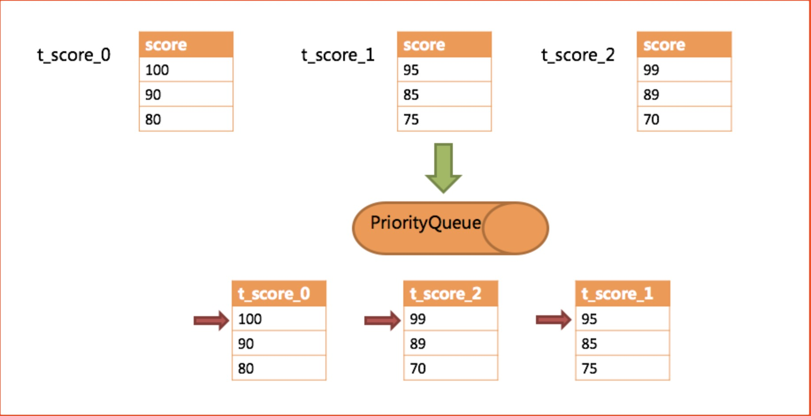
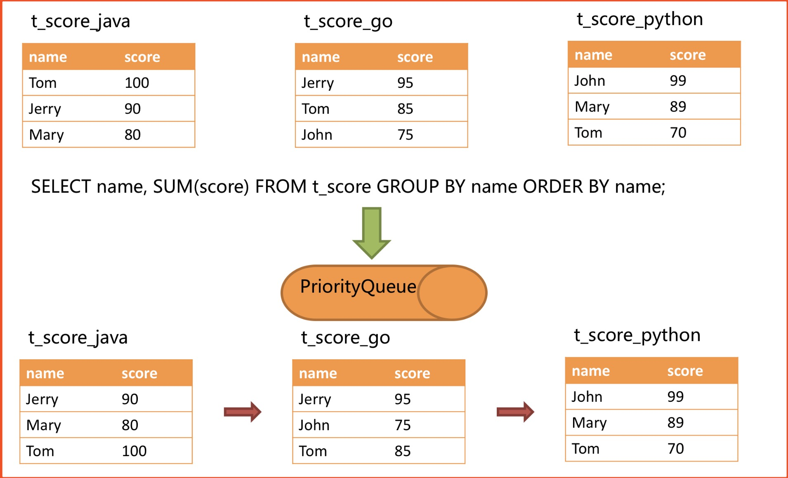
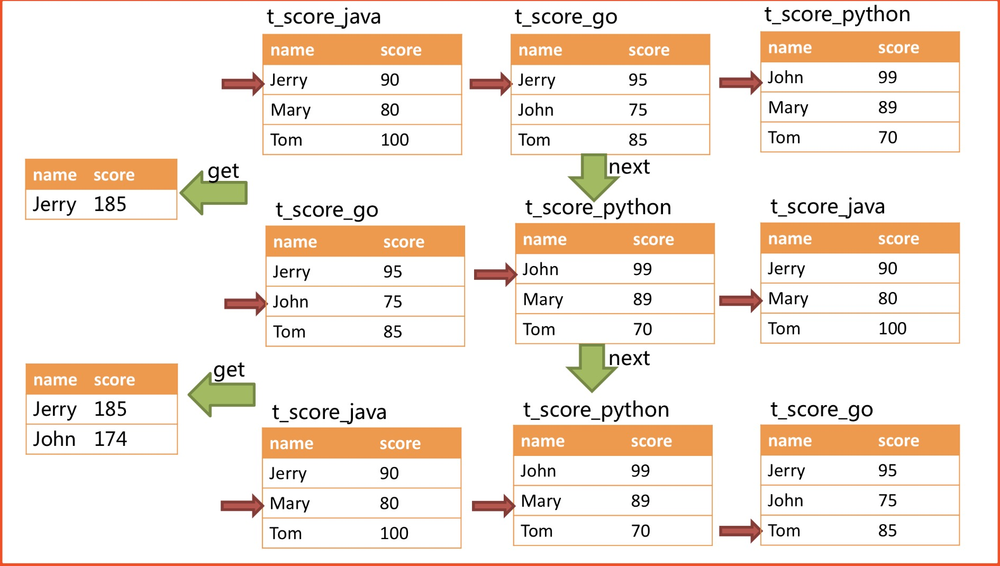
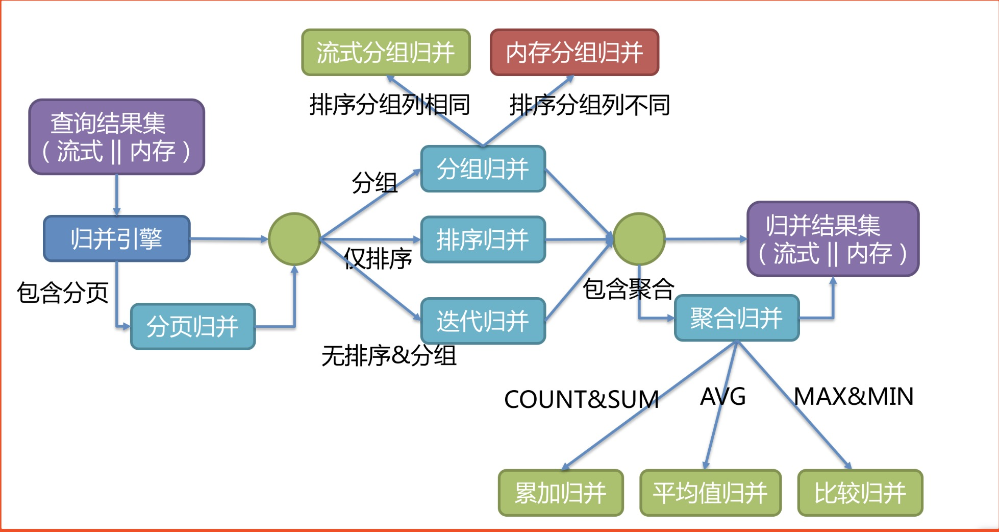

# Sharding Sphere
Sharding Sphere在中小企业需要分库分表的时候用的会比较多，因为它维护成本低，不需要额外增派人手。而且目前社区也还一直在开发和维护，还算是比较活跃。

但是中大型公司一般会选择选用 Mycat 这类 proxy 层方案，因为可能大公司系统和项目非常多，团队很大，人员充足，那么最好是专门弄个人来研究和维护 Mycat，然后大量项目直接透明使用即可。

## 一、Sharding Sphere 概念
### 1.1. 概念
Sharding Sphere 是一套开源的分布式数据库中间件解决方案组成的生态圈，它由**Sharding-JDBC**、**Sharding-Proxy** 和 **Sharding-Sidecar** 这3款相互独立的产品组成。

他们均提供标准化的**数据分片**、**分布式事务**和数**据库治理**功能，可适用于如Java同构、异构语言、云原生等各种多样化的应用场景。



### 1.2. 功能列表
### 1.2.1. 数据分片
- 分库 & 分表
- 读写分离
- 分片策略定制化
- 无中心化分布式主键

### 1.2.2. 分布式事务
- 标准化事务接口
- XA强一致事务
- 柔性事务

### 1.2.3. 数据库治理
- 配置动态化
- 编排 & 治理
- 数据脱敏
- 可视化链路追踪
- 弹性伸缩(规划中)

### 1.3. 项目状态


## 二、分库分表 - 结果归并
**概念** 

将从各个数据节点获取的多数据结果集，组合成为一个结果集并正确的返回至请求客户端，称为**结果归并**。

我们在实现分库分表之后，**遍历、排序、分组、分页 和 聚合** 操作变成不在一张表上进行SQL，而是多张表执行的结果进行归并。

所以我们来看下ShardingSphere实现这些操作的原理。

### 2.1. 遍历归并
遍历归并，它是最为简单的归并方式。只需将多个数据结果集合并为一个单向链表即可。在遍历完成链表中当前数据结果集之后，将链表元素后移一位，继续遍历下一个数据结果集即可。

### 2.2. 排序归并
由于在SQL中存在**ORDER BY**语句，每个数据结果集自身是有序的，所以我们要做的就是**对多个有序的数组进行排序**。

Sharding Sphere 在对排序的查询进行归并时，将每个结果集的当前数据值进行比较**（通过实现Java的Comparable接口完成）**，并将其放入**优先级队列**。

**每次获取下一条数据时，只需将队列顶端结果集的游标下移，并根据新游标重新进入优先级排序队列找到自己的位置即可。**

**举例**

下图是一个通过分数进行排序的示例图。 图中展示了3张表返回的数据结果集，每个数据结果集已经根据分数排序完毕，但是3个数据结果集之间是无序的。

将3个数据结果集的当前游标指向的数据值进行排序，并放入优先级队列，t_score_0的第一个数据值最大，t_score_2的第一个数据值次之，t_score_1的第一个数据值最小，

因此优先级队列根据t_score_0，t_score_2和t_score_1的方式排序队列。



下图则展现了进行next调用的时候，排序归并是如何进行的。 通过图中我们可以看到，当进行第一次next调用时，排在队列首位的t_score_0将会被弹出队列，并且将当前游标指向的数据值（也就是100）返回至查询客户端，并且将游标下移一位(90)之后，重新放入优先级队列。根据当前数值，t_score_0排列在队列的最后一位。 之前队列中排名第二的t_score_2的数据结果集则自动排在了队列首位。

在进行第二次next时，只需要将目前排列在队列首位的t_score_2弹出队列，并且将其数据结果集游标指向的值返回至客户端，并下移游标，继续加入队列排队，以此类推。

当一个结果集中已经没有数据了，则无需再次加入队列。


可以看到，Sharding Sphere 的排序归并，是在维护数据结果集的纵轴和横轴这两个维度的**有序性**。

**纵轴**，是指每个数据结果集本身，它是天然有序的，它通过包含ORDER BY的SQL所获取。

**横轴**，是指每个数据结果集当前游标所指向的值,它需要通过优先级队列来维护其正确顺序。 每一次数据结果集当前游标的下移都需要将该数据结果集重新放入优先级队列排序，

而只有排列在队列首位的数据结果集才可能发生游标下移的操作。

### 2.3. 分组归并
分组归并的情况最为复杂，它分为**流式分组归**并和**内存分组**归并。 流式分组归并要求SQL的排序项与分组项的字段以及排序类型（ASC或DESC）必须保持一致，否则只能通过内存归并才能保证其数据的正确性。

**举例**

假设根据科目分片，表结构中包含考生的姓名（为了简单起见，不考虑重名的情况）和分数。通过SQL获取每位考生的总分，可通过如下SQL：
```MySql
 SELECT name, SUM(score) FROM t_score GROUP BY name ORDER BY name;
```

在分组项与排序项完全一致的情况下，取得的数据是连续的，分组所需的数据全数存在于各个数据结果集的当前游标所指向的数据值，因此可以采用流式归并。如下图所示



进行归并时，逻辑与排序归并类似。 下图展现了进行next调用的时候，流式分组归并是如何进行的。



通过图中我们可以看到，当进行第一次next调用时，排在队列首位的t_score_java将会被弹出队列，并且将分组值同为“Jetty”的其他结果集中的数据一同弹出队列。 在获取了所有的姓名为“Jetty”的同学的分数之后，进行累加操作，那么，在第一次next调用结束后，取出的结果集是“Jetty”的分数总和。 与此同时，所有的数据结果集中的游标都将下移至数据值“Jetty”的下一个不同的数据值，并且根据数据结果集当前游标指向的值进行重排序。 因此，包含名字顺着第二位的“John”的相关数据结果集则排在的队列的前列。

流式分组归并与排序归并的区别仅仅在于两点：
- 它会一次性的将多个数据结果集中的分组项相同的数据全数取出。
- 它需要根据聚合函数的类型进行聚合计算。

### 2.4. 聚合归并
无论是流式分组归并还是内存分组归并，对聚合函数的处理都是一致的。 除了分组的SQL之外，不进行分组的SQL也可以使用聚合函数。 因此，聚合归并是在之前介绍的归并类的之上追加的归并能力，即装**饰者模式**。

聚合函数可以归类为比较、累加和求平均值这3种类型。

- 比较类型的聚合函数，是指 **MAX** 和 **MIN**。它们需要对每一个同组的结果集数据进行比较，并且直接返回其最大或最小值即可。
- 累加类型的聚合函数，是指 **SUM** 和 **COUNT**。它们需要将每一个同组的结果集数据进行累加。
- 求平均值的聚合函数只有 **AVG**。它必须通过SQL改写的SUM和COUNT进行计算，相关内容已在SQL改写的内容中涵盖，不再赘述。

### 2.5. 分页归并
上文所述的所有归并类型都可能进行分页，分页也是追加在其他归并类型之上的装饰器，Sharding Sphere 通过装饰者模式来增加对数据结果集进行分页的能力。 分页归并负责将无需获取的数据过滤掉。

Sharding Sphere 的分页功能比较容易让使用者误解，用户通常认为分页归并会占用大量内存。 在分布式的场景中，将LIMIT 10000000, 10改写为LIMIT 0, 10000010，才能保证其数据的正确性。 用户非常容易产生ShardingSphere会将大量无意义的数据加载至内存中，造成内存溢出风险的错觉。 其实，通过流式归并的原理可知，会将数据全部加载到内存中的只有内存分组归并这一种情况。 而通常来说，进行OLAP的分组SQL，不会产生大量的结果数据，它更多的用于大量的计算，以及少量结果产出的场景。

除了内存分组归并这种情况之外，其他情况都通过流式归并获取数据结果集，因此ShardingSphere会通过结果集的next方法将无需取出的数据全部跳过，并不会将其存入内存。

但同时需要注意的是，由于排序的需要，大量的数据仍然需要传输到ShardingSphere的内存空间。 因此，**采用LIMIT这种方式分页，并非最佳实践**。 **由于LIMIT并不能通过索引查询数据，因此如果可以保证ID的连续性，通过ID进行分页是比较好的解决方案**，例如：
```MySql
SELECT * FROM t_order WHERE id > 100000 AND id <= 100010 ORDER BY id;
```

或通过记录上次查询结果的最后一条记录的ID进行下一页的查询，例如：
```MySql
SELECT * FROM t_order WHERE id > 10000000 LIMIT 10;
```

### 2.6. 总结
用最后一张图来总结归并引擎的整体结构划分：



**补充：** 有关ShardingSphere其它的知识概述这里就不在讲了,这篇文章也是完全根据官方文档加上个人理解写的，所以想想要更加详细的了解可以去看官网。

## 三、参考
- [1. Sharding Sphere 官网](https://shardingsphere.apache.org/)
- [2. Sharding Sphere 中文文档](https://shardingsphere.apache.org/document/current/cn/overview/)
- [3. Sharding Sphere Github 库](https://github.com/apache/shardingsphere)