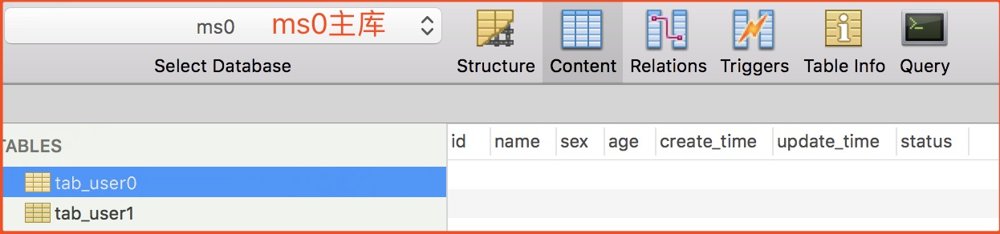
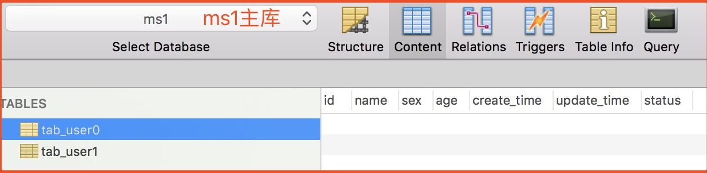
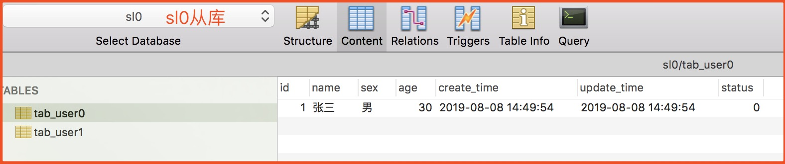
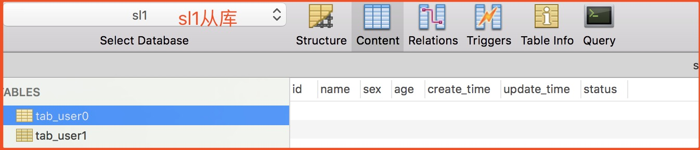
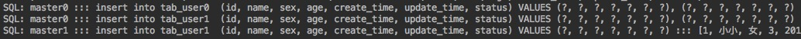
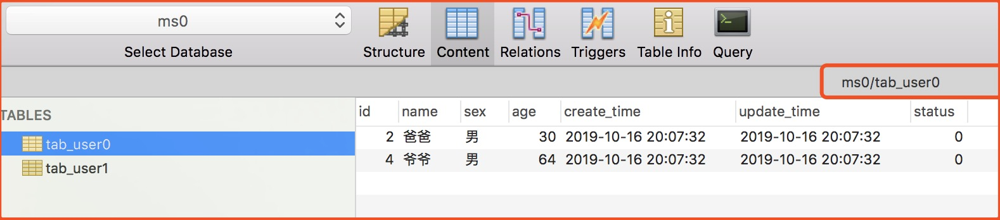
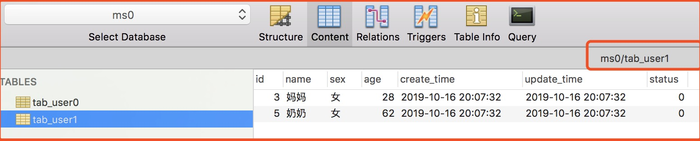
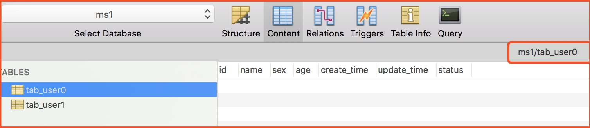
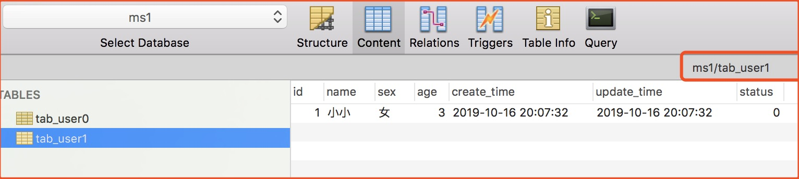
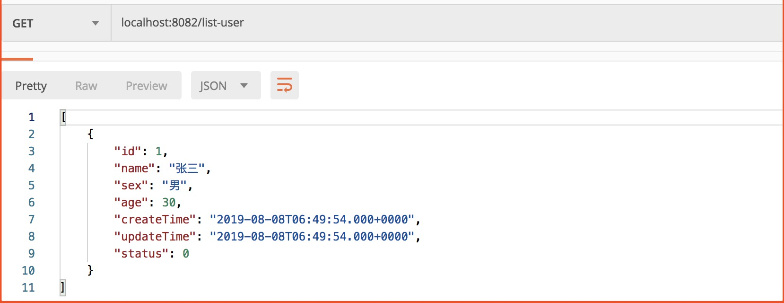

# SpringBoot + Sharding Sphere 实现分表分库 + 读写分离
## 一、项目概述
### 1.1. 项目说明
**场景：** 在实际开发中，如果数据库压力大我们可以通过 **分库分表** 的基础上进行 **读写分离**，来减缓数据库压力。

### 1.2. 数据库设计
**分库：** ms单库分库分为 ms0 库 和 ms1 库。

**分表：** tab_user单表分为 tab_user0 表 和 tab_user1 表。

**读写分离：** 数据写入 ms0 库 和 ms1 库，数据读取 sl0 库 和 sl1 库。

**ms0 - 主库**


**ms4 - 主库**


**sl0 - 从库**


**sl1 - 从库**


**说明：** 初始数据的时候，这边只有 sl0 从库 我插入了一条数据。那是因为我们这个项目中 MySql 服务器并没有实现主从部署，这四个库都在同一服务器上。做不到主数据库数据自动同步到从数据库，所以这里在从数据库建一条数据。等下验证的时候，我们只需验证数据是否存入 ms0 和 ms1 ，数据读取是否在 sl0 和 sl1 。

## 二、核心代码

**说明：** 这里只贴出与技术相关的代码，完整代码请参考项目。

### 2.1. application.properties
```properties
server.port=8082

#指定mybatis信息
mybatis.config-location=classpath:mybatis-config.xml
#打印sql
spring.shardingsphere.props.sql.show=true
#数据源 
spring.shardingsphere.datasource.names=master0,slave0,master1,slave1

spring.shardingsphere.datasource.master0.type=com.alibaba.druid.pool.DruidDataSource
spring.shardingsphere.datasource.master0.driver-class-name=com.mysql.jdbc.Driver
spring.shardingsphere.datasource.master0.url=jdbc:mysql://localhost:3306/ms0?characterEncoding=utf-8
spring.shardingsphere.datasource.master0.username=root
spring.shardingsphere.datasource.master0.password=root

spring.shardingsphere.datasource.slave0.type=com.alibaba.druid.pool.DruidDataSource
spring.shardingsphere.datasource.slave0.driver-class-name=com.mysql.jdbc.Driver
spring.shardingsphere.datasource.slave0.url=jdbc:mysql://localhost:3306/sl0?characterEncoding=utf-8
spring.shardingsphere.datasource.slave0.username=root
spring.shardingsphere.datasource.slave0.password=root

spring.shardingsphere.datasource.master1.type=com.alibaba.druid.pool.DruidDataSource
spring.shardingsphere.datasource.master1.driver-class-name=com.mysql.jdbc.Driver
spring.shardingsphere.datasource.master1.url=jdbc:mysql://localhost:3306/ms1?characterEncoding=utf-8
spring.shardingsphere.datasource.master1.username=root
spring.shardingsphere.datasource.master1.password=root

spring.shardingsphere.datasource.slave1.type=com.alibaba.druid.pool.DruidDataSource
spring.shardingsphere.datasource.slave1.driver-class-name=com.mysql.jdbc.Driver
spring.shardingsphere.datasource.slave1.url=jdbc:mysql://localhost:3306/slave1?characterEncoding=utf-8
spring.shardingsphere.datasource.slave1.username=root
spring.shardingsphere.datasource.slave1.password=root

#根据年龄分库
spring.shardingsphere.sharding.default-database-strategy.inline.sharding-column=age
spring.shardingsphere.sharding.default-database-strategy.inline.algorithm-expression=master$->{age % 2}
#根据id分表
spring.shardingsphere.sharding.tables.tab_user.actual-data-nodes=master$->{0..1}.tab_user$->{0..1}
spring.shardingsphere.sharding.tables.tab_user.table-strategy.inline.sharding-column=id
spring.shardingsphere.sharding.tables.tab_user.table-strategy.inline.algorithm-expression=tab_user$->{id % 2}

#指定master0为主库，slave0为它的从库
spring.shardingsphere.sharding.master-slave-rules.master0.master-data-source-name=master0
spring.shardingsphere.sharding.master-slave-rules.master0.slave-data-source-names=slave0
#指定master1为主库，slave1为它的从库
spring.shardingsphere.sharding.master-slave-rules.master1.master-data-source-name=master1
spring.shardingsphere.sharding.master-slave-rules.master1.slave-data-source-names=slave1
```
Sharding-JDBC可以通过 Java、YAML、Spring命名空间和 Spring Boot Starter四种方式配置，开发者可根据场景选择适合的配置方式，具体可以看官网。


### 2.2. UserController
```java
@RestController
public class UserController {

    @Autowired
    private UserService userService;

    /**
     * 获取用户列表
     */
    @GetMapping("list-user")
    public Object listUser() {
        return userService.list();
    }

    /**
     * 批量保存用户
     */
    @PostMapping("save-user")
    public Object saveUser() {
        List<User> users = Lists.newArrayList();
        users.add(new User("小小", "女", 3));
        users.add(new User("大大", "男", 5));
        users.add(new User("爸爸", "男", 30));
        users.add(new User("妈妈", "女", 28));
        users.add(new User("爷爷", "男", 64));
        users.add(new User("奶奶", "女", 62));
        return userService.insertForeach(users);
    }
}
```

## 三、测试验证
### 3.1. 批量插入数据
**请求接口：**
`localhost:8086/save-user`

我们可以从商品接口代码中可以看出，它会批量插入5条数据。我们先看控制台输出SQL语句。



我们可以从SQL语句可以看出 master0 和 master1 库中都插入了数据。

我们再来看数据库：

**ms0.tab_user0**


**ms0.tab_user1**


**ms1.tab_user0**


**ms1.tab_user1**


### 3.2. 获取数据
我们来获取列表接口的SQL。

```MySQL
select *  from tab_user 
```
**请求接口结果：**



**结论：** 从接口返回的结果可以很明显的看出，数据存储在主库,而数据库的读取在从库。

**注意：** ShardingSphere并不支持CASE WHEN、HAVING、UNION (ALL)，有限支持子查询。这个官网有详细说明。
