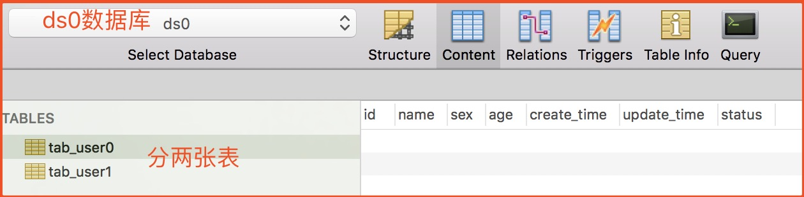
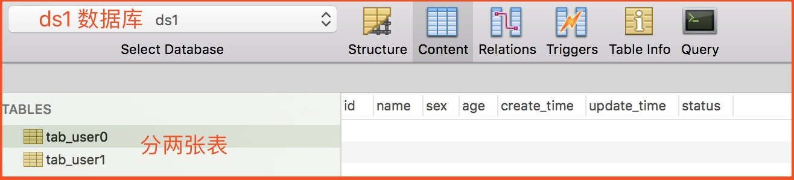
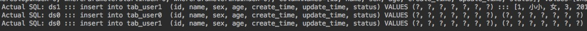
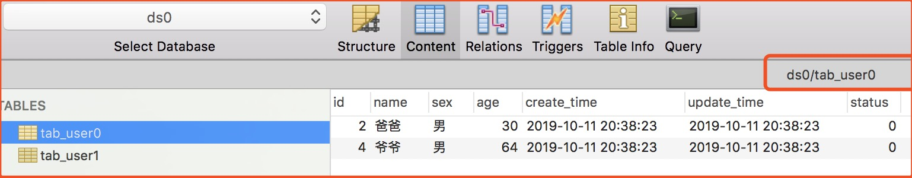
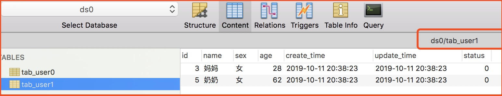
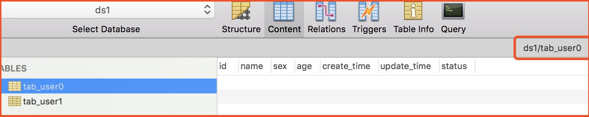
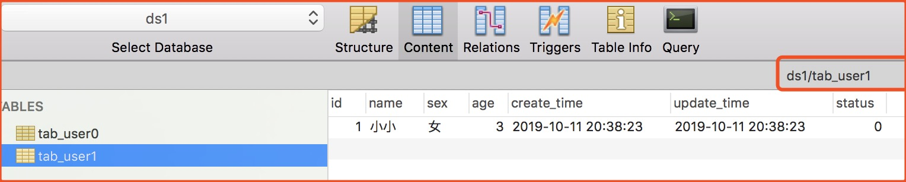
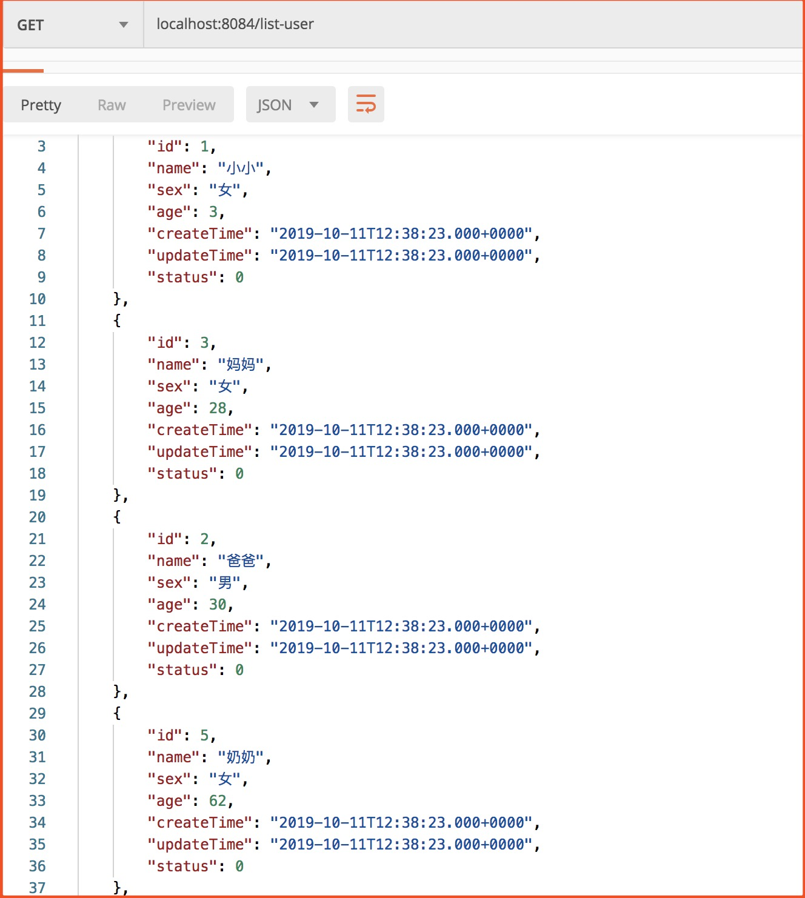

# SpringBoot + Sharding Sphere 实现分库分表
## 一、项目概述
### 1.1. 项目说明
**场景：** 在实际开发中，如果表的数据过大我们需要把一张表拆分成多张表，也可以垂直切分把一个库拆分成多个库，这里就是通过 Sharding Sphere 实现分库分表功能。

### 1.2. 数据库设计
**分库：** ds 一个库分为 **ds0** 库 和 **ds1** 库。

**分表：** tab_user 一张表分为 **tab_user0** 表 和 **tab_user1** 表。

**ds0 数据库**


**ds1 数据库**


## 二、核心代码

**说明：** 这里只贴出与技术相关的代码，完整代码请参考项目。

### 2.1. application.properties
```properties
server.port=8084

#指定mybatis信息
mybatis.config-location=classpath:mybatis-config.xml
#打印sql
spring.shardingsphere.props.sql.show=true

spring.shardingsphere.datasource.names=ds0,ds1

spring.shardingsphere.datasource.ds0.type=com.alibaba.druid.pool.DruidDataSource
spring.shardingsphere.datasource.ds0.driver-class-name=com.mysql.jdbc.Driver
spring.shardingsphere.datasource.ds0.url=jdbc:mysql://localhost:3306/ds0?characterEncoding=utf-8
spring.shardingsphere.datasource.ds0.username=root
spring.shardingsphere.datasource.ds0.password=root

spring.shardingsphere.datasource.ds1.type=com.alibaba.druid.pool.DruidDataSource
spring.shardingsphere.datasource.ds1.driver-class-name=com.mysql.jdbc.Driver
spring.shardingsphere.datasource.ds1.url=jdbc:mysql://localhost:3306/ds1?characterEncoding=utf-8
spring.shardingsphere.datasource.ds1.username=root
spring.shardingsphere.datasource.ds1.password=root

#根据年龄分库
spring.shardingsphere.sharding.default-database-strategy.inline.sharding-column=age
spring.shardingsphere.sharding.default-database-strategy.inline.algorithm-expression=ds$->{age % 2}
#根据id分表
spring.shardingsphere.sharding.tables.tab_user.actual-data-nodes=ds$->{0..1}.tab_user$->{0..1}
spring.shardingsphere.sharding.tables.tab_user.table-strategy.inline.sharding-column=id
spring.shardingsphere.sharding.tables.tab_user.table-strategy.inline.algorithm-expression=tab_user$->{id % 2}
```
Sharding-JDBC可以通过 Java、YAML、Spring命名空间和 Spring Boot Starter四种方式配置，开发者可根据场景选择适合的配置方式，具体可以看官网。


### 2.2. UserController
```java
@RestController
public class UserController {

    @Autowired
    private UserService userService;

    /**
     * 获取用户列表
     */
    @GetMapping("list-user")
    public Object listUser() {
        return userService.list();
    }

    /**
     * 批量保存用户
     */
    @PostMapping("save-user")
    public Object saveUser() {
        List<User> users = Lists.newArrayList();
        users.add(new User("小小", "女", 3));
        users.add(new User("大大", "男", 5));
        users.add(new User("爸爸", "男", 30));
        users.add(new User("妈妈", "女", 28));
        users.add(new User("爷爷", "男", 64));
        users.add(new User("奶奶", "女", 62));
        return userService.insertForeach(users);
    }
}
```

## 三、测试验证
### 3.1. 批量插入数据
**请求接口：**
`localhost:8084/save-user`

从商品接口代码中可以看出，它批量插入5条数据，我们先看控制台输出SQL语句：



我们可以从SQL语句可以看出 ds0 和 ds1 库中都插入了数据，我们再来看数据库：

**ds0.tab_user0**


**ds0.tab_user1**


**ds1.tab_user0**


**ds1.tab_user1**


从上面我们可以看到 Sharding Sphere 已经帮我们完成分库分表插入数据。

### 3.2. 查询数据
这里获取列表接口的SQL，这里对SQL做了Order排序操作，具体 Sharding Sphere 分表实现order操作的原理可以看之前的 Sharding Sphere 理论了解。

```MYSQL
#根据年龄排序
select *  from tab_user order by age;
```

请求接口结果展示：



我们可以看出虽然已经分库分表，但依然可以将多表数据聚合在一起并可以支持按 AGE 排序。

**注意：** Sharding Sphere 并不支持**CASE WHEN、HAVING、UNION (ALL)**，有限支持子查询，这个官网有详细说明。
